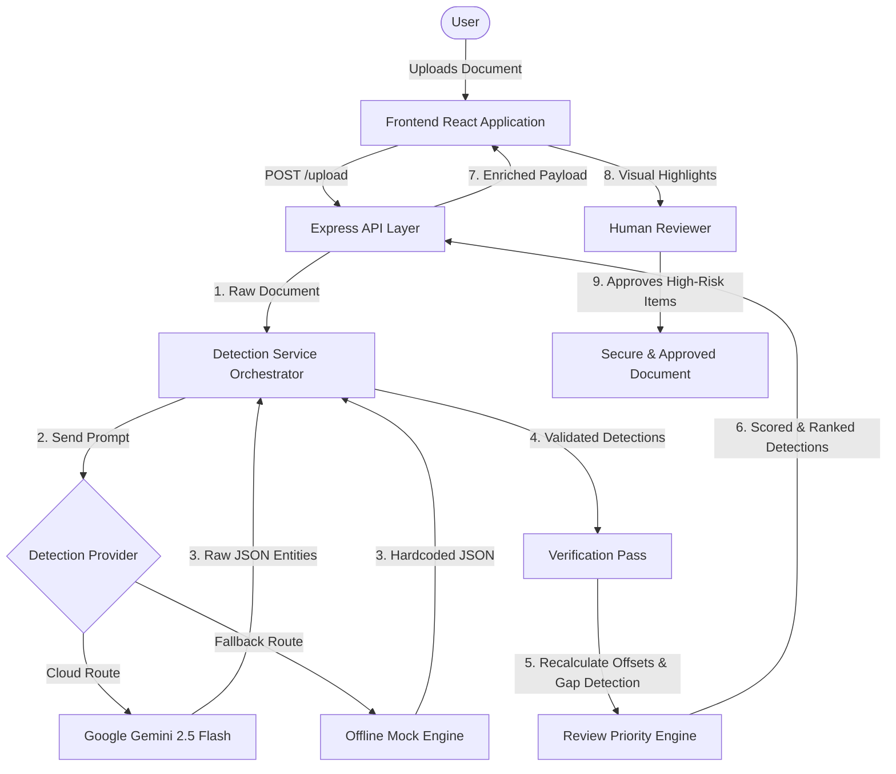

# SentinelIQ

## **[https://sentinel-iq-five.vercel.app/](https://sentinel-iq-five.vercel.app/)**
### **Demo Video: [https://youtu.be/UUlbiIT3T7k](https://youtu.be/UUlbiIT3T7k)**
> Note: Network is very slow so the link might still be uploading the video.

**PII Review Priority Tool — Built for the SprintFour Hackathon**

[](https://opensource.org/licenses/MIT)
[](https://nextjs.org/)
[](https://expressjs.com/)
[](https://ai.google.dev/)

---

## 📖 Product Overview
SentinelIQ is a Human-in-the-Loop (HITL) compliance and redaction dashboard. It utilizes Google's Gemini 2.5 Flash model to extract Personally Identifiable Information (PII) from unstructured documents and ranks those detections based on human cognitive risk heuristics.

## ⚠️ Problem Statement
Fully automated AI redaction systems are dangerous because Large Language Models hallucinate false positives and confidently miss edge cases. To ensure compliance, humans must still review the documents. However, traditional review tools present PII flags chronologically, leading to severe **reviewer fatigue**. Reviewers waste mental energy approving hundreds of standard email addresses, causing them to miss the critical, unformatted Social Security Number buried on page 42.

## 💡 Core Insight
Not all PII detections require the same cognitive effort. By ranking the AI's detections based on **human cognitive risk**—placing ambiguous, hard-to-see, low-confidence, and high-severity items at the absolute top of the queue—we ensure the reviewer's freshest attention is spent on the most dangerous potential data leaks.

## 🌟 Novelty & Uniqueness
Most PII redaction tools compete entirely on **Extraction Accuracy** (trying to build a better AI that misses less). SentinelIQ takes a completely unique approach by focusing on **Human Psychology and Reviewer Fatigue**. 
Instead of treating all AI detections equally, SentinelIQ introduces a deterministic **Priority Engine** that asks: *"How likely is a human to miss this?"* 
By quantifying visual density, single-occurrences, formatting anomalies, and AI uncertainty, SentinelIQ creates an **Attention Queue** that forces humans to triage the most dangerous and hidden leaks first. It acknowledges that Humans-in-the-Loop are the ultimate safety net, and optimizes the UI to protect them from fatigue.

---

## 🏗️ Architecture



*(Note: See the `docs/architecture/` folder for detailed system designs and sequence flows).*

## 🛠️ Tech Stack
- **Frontend**: Next.js (React), Tailwind CSS, Zustand, Lucide React
- **Backend**: Node.js, Express, Multer
- **AI Model**: Google Gemini 2.5 Flash (`@google/generative-ai`)

## ✨ Features
- **Attention Queue**: Automatically ranks high-risk anomalies to the top of the queue to combat reviewer fatigue.
- **Explainable Heuristics**: Deterministic rule engine provides human-readable reasons (e.g., "Buried in dense paragraph", "Single occurrence") for every priority ranking.
- **Verification Pass Layer**: Regex safety nets catch obvious items the AI missed (False Negatives).
- **Auto-Offset Repair**: Fixes LLM numerical hallucinations by using exact substring matching on the source document.
- **Graceful Fallback Engine**: Prevents UI corruption by isolating AI network failures and routing to a local Mock provider for demos.
- **Glassmorphism UI**: Beautiful, immersive, and responsive workspace designed to reduce eye strain.

---

## 📸 Screenshots
*(Placeholder for Main Dashboard Screenshot)*
``

## 🎥 Demo
*(Placeholder for 90-Second Demo GIF)*
``

---

## 📂 Folder Structure

```text
Sentinel_IQ/
├── backend/
│   ├── data/                 # Sample documents
│   ├── providers/            # CloudLLM (Gemini) & Mock AI engines
│   ├── schemas/              # Data validation and strict offset checking
│   ├── services/             # Orchestration and Review Priority algorithms
│   └── server.js             # Express REST API
├── docs/                     # Comprehensive Project Documentation
│   ├── api/                  # API Specifications and JSON schemas
│   ├── architecture/         # System architecture and engine deep-dives
│   ├── decisions/            # Architecture Decision Records (ADRs)
│   ├── diagrams/             # Mermaid.js diagrams
│   └── product/              # Vision, Tradeoffs, and Judging Alignment
├── frontend-next/            
│   ├── src/
│   │   ├── app/              # Next.js global styles (globals.css)
│   │   ├── components/       # DetectionCards, Buttons, Popovers
│   │   ├── lib/              # Zustand Store and API wrappers
│   │   └── views/            # Main Screens (Landing, Upload, Review)
└── package.json              # Project dependencies and scripts
```

---

## 🚀 Setup & Installation

### Prerequisites
- Node.js (v18+)
- A Google Gemini API Key

### Installation
1. Clone the repository:
   ```bash
   git clone https://github.com/Naren-bit/Sentinel_IQ.git
   cd Sentinel_IQ
   ```
2. Install root dependencies (or navigate to `frontend-next` and `backend` separately):
   ```bash
   npm install
   cd frontend-next && npm install
   cd ../backend && npm install
   ```

### ⚙️ Running Locally

SentinelIQ requires both the backend API and the frontend to be running simultaneously.

**Terminal 1 (Backend)**
```bash
cd backend
export GEMINI_API_KEY="your_api_key_here" # Optional (demo mode available without key)
npm run dev
```
*The backend runs on `http://localhost:3001`*

**Terminal 2 (Frontend)**
```bash
cd frontend-next
npm run dev
```
*The frontend runs on `http://localhost:3000`*

---

## 🔌 API Overview

*   **`POST /upload`**: Accepts a `multipart/form-data` file (`.txt`, `.pdf`, `.docx`), extracts text, and runs the Detection -> Verification -> Prioritization pipeline.
*   **`POST /review`**: Accepts raw JSON text string for analysis.
*   **`GET /health`**: Standard server health check.

*See `docs/api/api-spec.md` for detailed request/response schemas.*

---

## 🌐 Deployment

SentinelIQ is designed to be deployed as two separate services:
1.  **Frontend**: Deployed to Vercel or Netlify.
2.  **Backend**: Deployed to a Node.js runtime (e.g., Heroku, Render, AWS Elastic Beanstalk). Ensure the `GEMINI_API_KEY` is securely stored in the environment variables.

*See `docs/architecture/deployment.md` for topology diagrams.*

---

## 🗺️ Roadmap
- [ ] Integrate Tesseract.js / Google Cloud Vision for OCR on scanned PDFs.
- [ ] Create an Admin Settings dashboard to let users customize the Priority Engine heuristic weights.
- [ ] Implement asynchronous batch processing via Redis/BullMQ.
- [ ] Add SSO / SAML Authentication for enterprise deployments.

---

## 📄 License
This project is licensed under the MIT License. See the LICENSE file for details.
